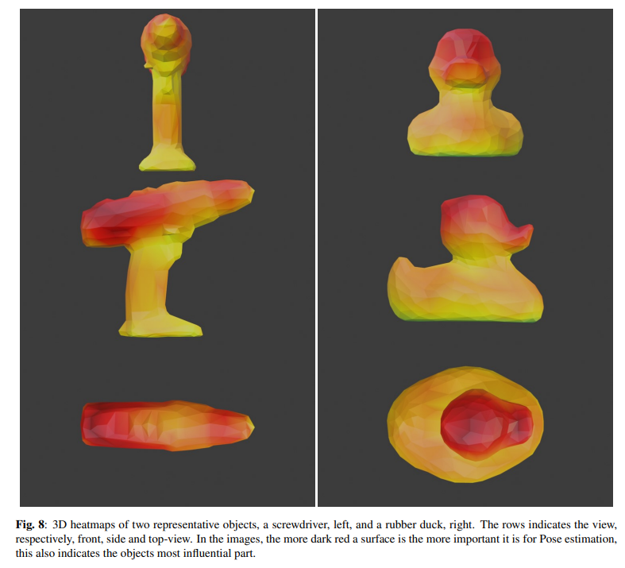
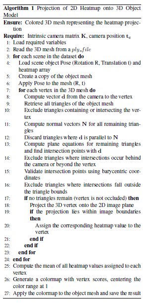

# Supplementary Materials Page
## 3D-Heatmap-of-Object-Pose-Estimation-Estimation-Supplementary-Material

This page supports the article "3D Heatmap for Object Pose Estimation" with the follwing:
* 3D heatmaps views for the screwdriver and the rubber duck objects
* 3D heatmaps blender files for LM-O dataset objects
* Projection of 2D Heatmap onto 3D Object Model Algorithm
* LLM zero-shot system prompt used for 2D heatmap explanation

---

### Abstract

We introduce a 3D heatmap visualization to explain and debug 6D object pose estimation. The method computes occlusion-based 2D sensitivity maps and projects them onto the object surface, producing object-space 3D heatmaps that reveal which parts drive each prediction and help diagnose failure modes and model interpretability. We also incorporate targeted architectural and training modifications to improve an efficient pose estimation network. On the LM-O (LineMOD-Occluded) dataset, our model achieves a 69.3\% BOP score with an inference time of 0.0804~s per object on an NVIDIA RTX 2060. Our 3D heatmap algorithm was also applied for comparison to SurfEmb-RGB, and the resulting interpretable, fast, and accurate pipeline is well-suited for safety-critical robotic cells and AR devices, where both high performance and explainability are essential.

---

### 3D heatmaps views for the screwdriver and the rubber duck objects


---

### 3D Heatmaps
* Blender file for Ape: [ape.blend](https://dsoldev.github.io/supmat/heatmap3d/ape.blend)
* Blender file for Benchvise: [benchvise.blend](https://dsoldev.github.io/supmat/heatmap3d/benchvise.blend)
* Blender file for Bowl: [bowl.blend](https://dsoldev.github.io/supmat/heatmap3d/bowl.blend)
* Blender file for Camera: [camera.blend](https://dsoldev.github.io/supmat/heatmap3d/camera.blend)
* Can blender file for Can: [can.blend](https://dsoldev.github.io/supmat/heatmap3d/can.blend)
* Cup blender file for Cup: [cup.blend](https://dsoldev.github.io/supmat/heatmap3d/cup.blend)
* Driller blender file for Driller: [driller.blend](https://dsoldev.github.io/supmat/heatmap3d/driller.blend)
* Duck blender file for Duck: [duck.blend](https://dsoldev.github.io/supmat/heatmap3d/duck.blend)
* Glue blender file for Glue: [glue.blend](https://dsoldev.github.io/supmat/heatmap3d/glue.blend)
* Holepuncher blender file for Holepuncher: [holepuncher.blend](https://dsoldev.github.io/supmat/heatmap3d/holepuncher.blend)
* Lamp blender file for Lamp: [lamp.blend](https://dsoldev.github.io/supmat/heatmap3d/lamp.blend)
* Phone blender file for Phone: [phone.blend](https://dsoldev.github.io/supmat/heatmap3d/phone.blend)

---

### Projection of 2D Heatmap onto 3D Object Model Algorithm


---

### LLM zero-shot system prompt used for 2D heatmap explanation

```python
SYSTEM_TEMPLATE = """
You are a computer-vision heatmap specialist.

The image you receive ALWAYS has:
* Left side -> original photo
* Right side -> the same photo with a JET heatmap overlay (red = hot, blue = cold)
  at ~50 % transparency.

Your task:
1. Look ONLY at the right side (heatmap).
2. Locate where the components named below are.
3. Visually judge which components show hot colors (red).
4. Return *only* a list with the name(s) of those components,
   using exactly the names below:

{component_list}

If the heat is evenly distributed and no component stands out,
return an empty list: [].
```


---